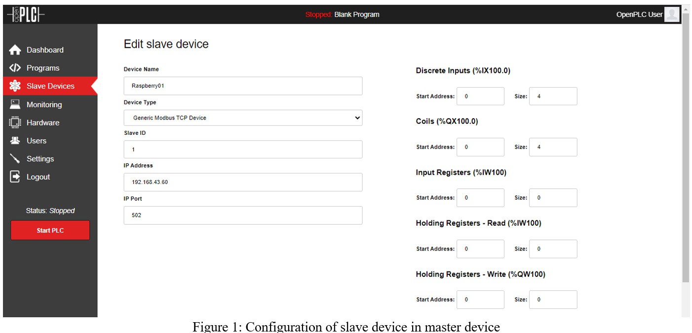
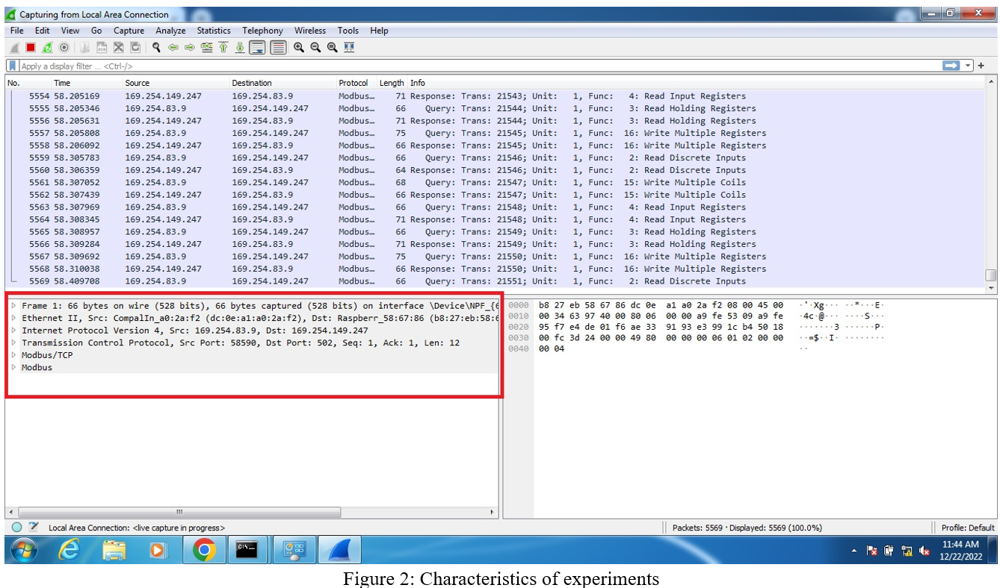
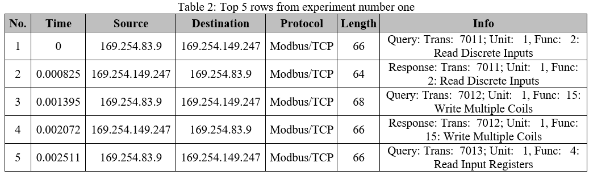
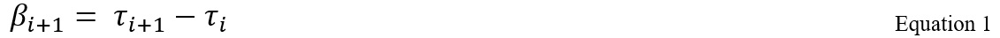
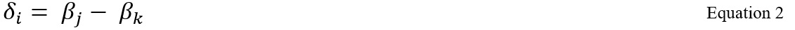
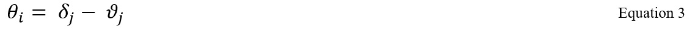
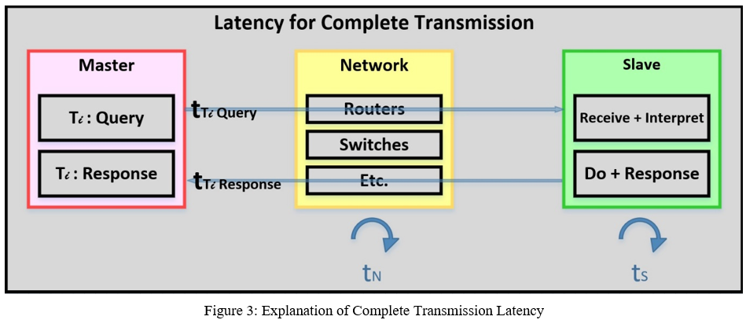
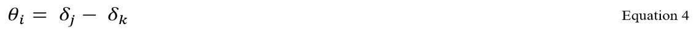
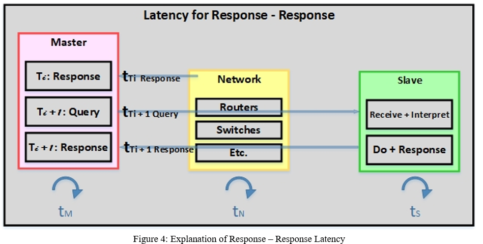
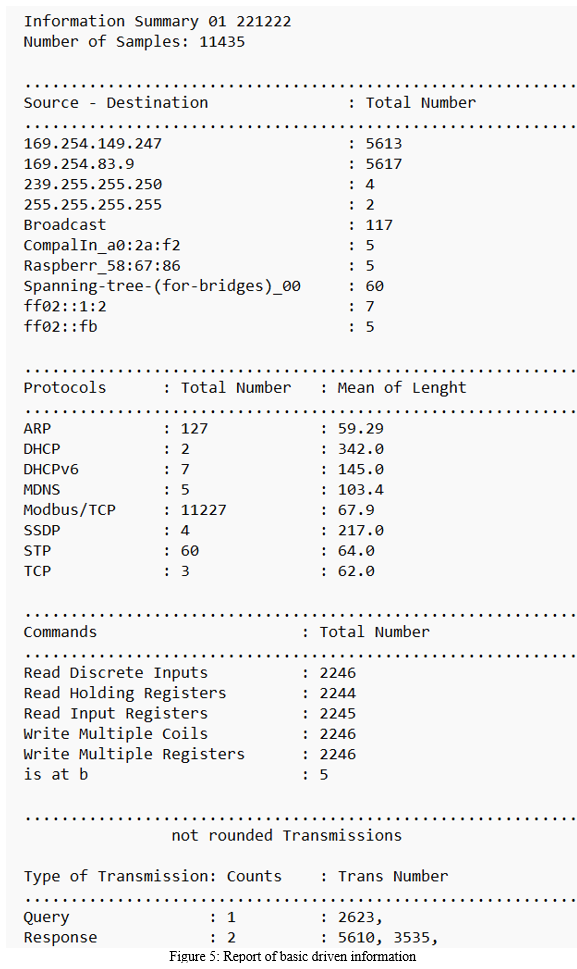

# network-traffic-analysis
** **Notification** **

As a reader of this notebook, images would be shown correctly. Accordingly, in the following link discriptions and images are shared in a pdf file.

https://drive.google.com/file/d/1SmndHWLj_Kq2FRSjc1d3KyJSFw94AGmS/view?usp=sharing

**1-Installation**

Install OpenPLC Runtime on both Master and Slave. Upload ‘elegant_v11.st’ program from repository ‘https://github.com/bmsousa/elegant’ on slave, then set up slave device by following configuration. To capture traffic, install Wireshark Network Analyzer (Version 4.0.2 - v4.0.2-0-g415456d13370).

•	Configuration of slave device in master device as shown in figure 1.

•	Connect master and slave with cat5 cable with length of 2 m.

First, run OpenPLC Runtime in slave then run it in master, second run OpenPLC Runtime in master, at the end start Wireshark capturing and let it to capture for about 2 min. Make screen shot considering characteristics of experiments as shown in figure 2. Save pcab file with appropriate name (for example including the date and the number of experiment). In addition, export report to csv. Do the same things for more 4 times.

**2-Devices**

**2-1-Master:**

ACER ASPIRE V3-571 (Intel Core i52450M 2.5GHz turbo boost up to 3.1GHz, 8GB DDR3)

**2-2-Slave:**

Raspberry Pi 3 Model B+ (1.4GHz 1.4GHz)

**2-3-Switch:**

3Com 3C17304A 4200 28-Port 10/100 Fast Ethernet Switch

**3-Preprocessing of dataset**

To analyze data, methods and functions of Pandas package is considered as the main tool to deal with raw data. In Table 1 all applied packages are mentioned. In table 1 top 5 rows from experiment number one, is shown to get familiar with the features and cell’s data format.

Table 1: Python packages applied to dealing with data

**4-Queries and Preprocessing**

Before everything, to apply all captured files in the same codes, it is necessary to rename all ‘csv’ files in precise format. So, a python code ‘rename_pcab_files.py’ is developed (e.g., ‘Pcab 01 221222.csv’)

**4-1-Main queries from raw data.**

As it is shown in table 2, some basic queries regarding captured packages including source Ips, Protocols, Length, etc. could be driven. For doing mentioned basic queries ‘pcab_analysis_v02.py’ is developed which generate two kinds of files including ‘*.csv’ and ‘*.txt’. The report is in ‘txt’ format which is shown in figure 1 (e.g., ‘Information Summary 01 221222.txt’)

**4-2-Preprocessing of raw data**

As it is shown in table 1, the last column (‘Info’) includes different information such as ‘Query/Response’, ‘Trans Number’, ‘Function Number’ and ‘Function Description’. To deal with this column, in preprocessing program it is divided into six columns extracted via program ‘pcab_analysis_v02.py’:

•	‘Info_01’: it shows that the packet belongs to Query or Response.

•	‘Commands’: it shows command, in another word functions related to each packet.

•	‘Trans’: it shows transmission number for each packet.

•	‘R_W’: it is extracted form ‘Commands’ which is divided by three and includes: ‘Write’ or ‘Read’ as the first part of commands’ phrase.

•	‘D_M_I_H’: it is extracted as the same as ‘R_W’ and includes: 'Discrete', 'Multiple', 'Input' or 'Holding' as the second part of commands’ phrase.

•	‘I_C_R’: it is extracted as the same as ‘R_W’ and includes: ‘Inputs’, ‘Coils’ or ‘Registers’  as the third part of commands’ phrase.

**4-3-Calculating new items**

Regarding doing analysis, it is necessary to calculate some and assign new columns which inspire meaning to some raw data. For instance, regarding understanding round trip of packets, times related to precise transmission number; however, the first step is calculation of each packet time length. Some calculation formulas are mentioned in the following equation:

In which β shows basic time difference, τ shows time related to each one-way transmission and i shows the raw number. Box plot and histogram is drawn by programs ‘pacb_histogram.py’ and ‘pcab_boxplot.py’.

In which δ shows time duration of round-trip packet for transmission number i (data in ‘Trans’ column), j is raw belongs to ‘Response’ joined with i and k is raw belongs to ‘Query’ joined with i. Note that, there is not any column including δ_i , instead it is issued by making queries from dataset. Box plot and histogram is drawn as previous.
As the same as previous, it is possible to query times interval between each query by sequence of transmission number and each response and box plot and histogram is drawn.
It is assumed that difference of times between query and responses for a specific transmission is equal to the time of delay of packet transmission Box plot and histogram is drawn as previous.

In which θ shows packet consumption’ for transmission number i (data in ‘Trans’ column), δ_j is raw belongs to ‘Query’ joined with i and ϑ_j is raw belongs to ‘Response’ joined with i.

Figure 3: First parst Explain Complete Transmission Latency following the idea of second part (Reference of below part of figure: Antonio Virdis, Giovanni Nardini, Giovanni Stea and Dario Sabella "End-to-End Performance Evaluation of MEC Deployments in 5G Scenarios", doi:10.3390/jsan9040057)

It is assumed that difference of times between two responses is equal to the time of processing in master plus time consumption to send message from master to slave plus processing time in slave and at the end plus time consumption to response to the master which is considered as ‘packet consumption’ time in this experiment. Box plot and histogram is drawn as previous.

In which θ shows packet consumption’ for transmission number i (data in ‘Trans’ column), j is raw belongs to ‘Response’ joined with i and k is raw belongs to ‘Response joined with i+1.

**5-Remarks**

Durations of these Runnings are considered 120 s, in other words capturing could be for a longer period and only 120 s of that extracted to study.

Some transmissions are not completed during the considered time slot which are detected and shown in *.txt report files. In addition, must be omitted for some statistical analysis.

In some selected time slot, data set is started by response which is related to a query that is not in extracted time slot, so this raw must be omitted from dataset.

From this point to end of results, the python functions which generate the results have been described.

** **Important Notice** **

**1-**

* Moving forward, all images required for the report will be generated using code. For instance, the image labeled as Figure 5 above is created using the codes provided below.

**2-**

* There are various parameters associated with image generation that you can adjust to enhance your understanding of their significance in the graphs.

**3-**

* For each each fiure based on their number, some fuctiond are developed in the following whit the name of figures respectedly. For instanse "figure_06 refered to fuctions genearting figure 6 of this report.

**===============================================================================================**

** **Imprtant Notice to Run Perfectly** **

If you want 'Run All', please consdier put:

**For 1st Run**

* permission_df_generating = True

* permission_graphs_drawing = False

**For 2sd Run**

* permission_df_generating = False

* permission_graphs_drawing = True

* Consider to extract generated csv file generated address from /kaggle/working/

in next code block, otherwise errors will be appeared

****Never Run 2sd part more than one time****

**===============================================================================================**

** **Caution** **

Results of analyses are available either in notebook file or Results folder

**===============================================================================================**

**6	Results**

To have better perception of captured traffic a summary has been extracted from raw data as shown in figure 5. Accordingly, histograms of different time latency which are discussed in the beginning of section four are drawn in figure 6.

To have a better conception for distribution of different Modbus functions, all of calculated parameters are divided to detected Modbus functions which are extracted from the command column. Figures 7, 8 and 9 are extracted from preprocessed data based on what is discussed in section 4.

To study the role of outliers in regarding followed scenarios to draw figures 6-9, histogram of three defined time latencies for all five experiments which are separated based on five Modbus functions that were used in the experiments are shown in figure 10.

**7 Discussion and Conclusion**

considering figure 5 or text report file it is clear the program could fin only five Modbus functions as commands which are:

* Read Discrete Inputs
* Read Holding Registers
* Read Input Registers
* Write Multiple Coils
* Write Multiple Registers

The five above mentioned commands form the main groups to study distribution of time for all three main considered scenarios:

1. Basic time difference.
2. Response-Response time difference.
3. Query-Response time difference.

In general figure 6 shows time latency for all scenarios without considering Modbus commands that is evidence that during all five experiments the majority of latencies are in domain real time concept (< 25ms or < 0.025s). To have a better analysis in figure 7-9 histogram, boxplot and mean scatter plot are drawn.

Figure 7 shows the distribution of different Modbus commands which are detected by codes. According to the figure: i) values for command "Read Discrete Input" are always out of the range of real time, ii) "Write Multiple Coils" are always out of the minimum time to be considered as real time, iii) in general number of "Read Input Register" values are very small and out of the real time domain in all scenarios, iv) 'Read Holder Register" is always bigger than 25ms seconds and finally v) in scenarios 1 and 3 "Write Multiple Registers" are always in real time domain; however some of them in scenario 2 are not.

Boxplots in figure 8, are completely aligned with the results of histogram in figure 7, i) values for command "Read Discrete Input" are in very long domain from 0-120ms and its median is around 30ms which is worse in scenario 2, however in 3rd scenario its distribution gets narrow with noncountable numbers of outliers, ii) "Write Multiple Coils" are full of outliers; however, in general it median is around 0, iii) "Read Input Register" also shows a lot of outliers in which they are out of the concept of real time and it is more or less the same for all scenarios, iv)"Read Holder Register" is the same as iii and consequently v) "Write Multiple Registers" follow concept as previous items.

It seems that considering the meaning of values is the easiest way to conclude which commands have been done in real time during five experiments which are aligned with above mentioned discussion. As shown in figure in figure 9, only "Read Discrete Input" values are always out of the range of real time events; however, only in scenario 2, "Write Multiple Coils" is out of real time. In other situation the performance of Modbus commands are occurred in real time.

Figure 10 presents the same histogram as the same figure 7 after deleting outliers. Even though some commands disappear from histogram or impossible to detect clearly, no considerable difference could be supposed for above mentioned discussion.
